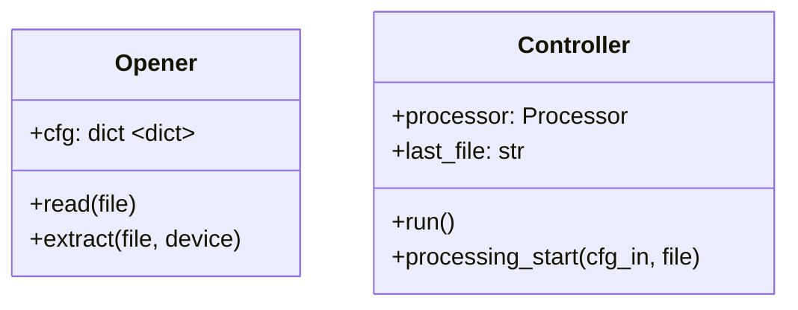
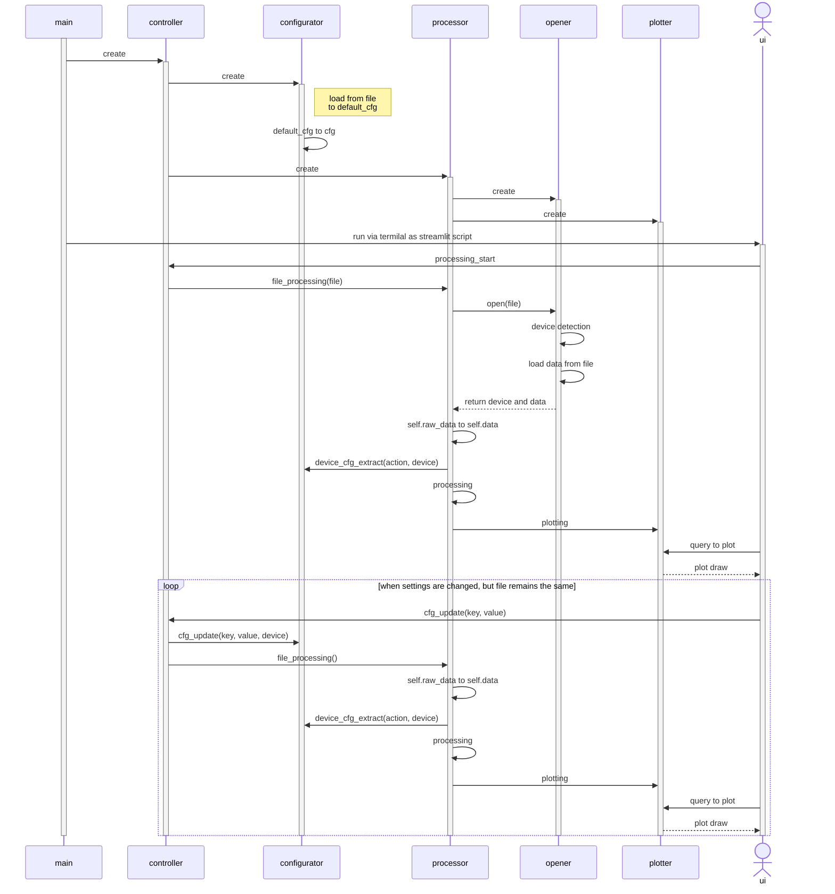

# Программа обработки экспериментальных данных

## Todo

- Загруженный файл может быть 200 МБ [максимально](https://docs.streamlit.io/library/api-reference/widgets/st.file_uploader).
- Графопостроение с интерактивными элементами (как в qt-варианте бэкенда matplotlib).
- Неограниченное количество каналов для обработки.
- Возможность открытия файлов приборов, не реализованных на данный момент.
- Коэффициенты преобразования.
- Минимальные и максимальные значения ограничений по времени, окна скользящей средней и числа выборок для определения сдвига ноля.

## UML-диаграммы

### Диаграмма классов

### Диаграмма последовательности

