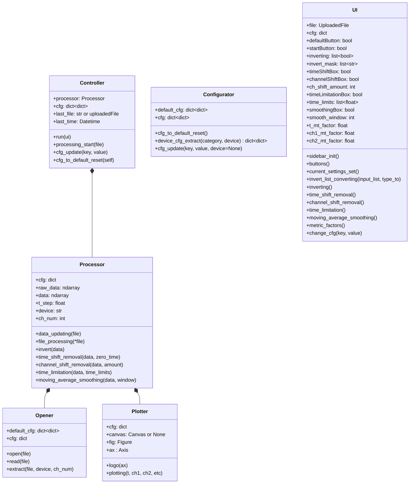
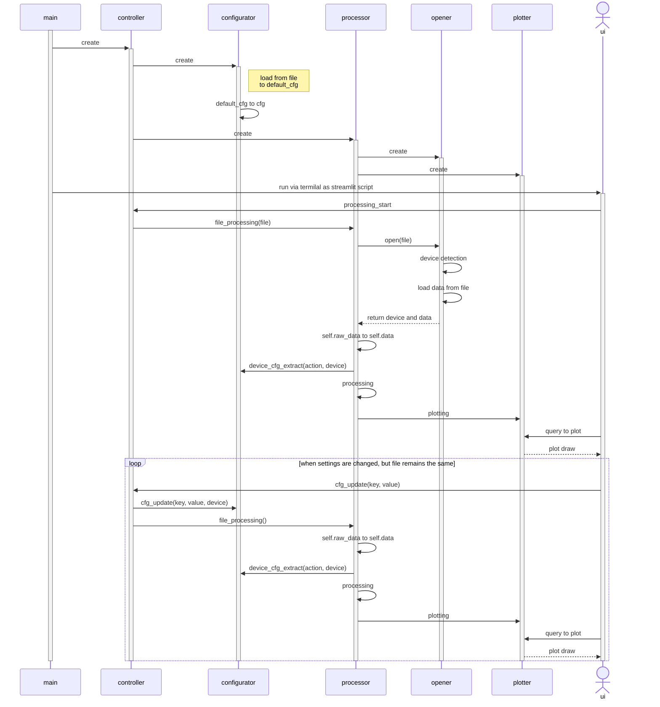

# Программа обработки экспериментальных данных

**Автор**: Пунина Полина Викторовна

## Цели и задачи работы

**Цель** работы: реализация программы обработки данных, способной взаимодействовать с файлами осциллографических записей различных приборов.

**Задачи**:

1. создать алгоритмы определения использованного для записи прибора в соответствии со структурой файла;
2. реализовать функционал импорта данных из файла независимо от его структуры;
3. реализовать необходимые функции обработки данных;
4. реализовать возможности графопостроения.

## Актуальность работы

В связи с наличием большого числа записывающих приборов, файлы записей которых значительно отличаются по своей структуре, необходимым является создание программы, позволяющей импортировать данные из полученных файлов для их последующей обработки. Пример различия в структурах файлов приведен на рисунке 1.


Помимо этого, файлы записей зачастую отличаются значительным объемом (более 2 ГБ, более 10 млн выборок). Обычные средства обработки данных (MS Excel, Mathcad, Matlab) либо не способны работать с файлами подобного объема, либо обладают меньшим функционалом и возможностями в решении широкого круга задач в сравнении с использованием языка Python в его совокупности с набором научных библиотек (NumPy, SciPy, Pandas, Matplotlib).

## Описание работы элементов программы

### main.py

Содержит справочную информацию, импортирует модуль controller.py. Т.к. предполагается реализация программы в различных вариантах пользовательского интерфейса, определяет кортеж поддерживаемых ~~пока еще нет~~ вариантов интерфейса, после чего методом run() управляющего объекта, созданного в модуле controller.py, запускает программу с выбранным вариантом интерфейса (web-приложение через интерфейс Streamlit).

### controller.py

Выполняет запуск программы с выбранным вариантом интерфейса, и, по команде из интерфейса, запуск обработки файла,  обновление настроек и сброс значений настроек в положение по умолчанию.

### processing.py

Выполняет обработку импортированных данных согласно алгоритму, заданному в настройках. На текущий момент способен обеспечить инвертирование, установку на ноль по времени и исследуемым сигналам, выделение временного диапазона и сглаживание скользящей средней. Обработанные данные впоследствии визуализируются. Способен работать в отдельности от интерфейса при запуске через терминал.

### opener.py

Открывает файлы, сравнивая при этом первую строку файла с заданными в настройках сигнатурами приборов. При выполнении из терминала или использовании qt интерфейса файл открывается напрямую, при использовании Streamlit объект FileUploader данного модуля создает образ файла в оперативной памяти, который затем открывается при помощи модуля io стандартной библиотеку. После определения прибора выполняется метод извлечения данных, поведение которого уникально в зависимости от использованного прибора. Полученные данные приводятся к типу ndarray библиотеки NumPy, написанной на C и отличающейся значительно более высокой скоростью вычислений и большим удобством при работе с массивами, нежели нативный Python.

### plotter.py

Визуализирует обработанные данные, создавая при этом либо независимую фигуру, либо фигуру, размещенную в указанном при создании объекте.

### config.py

Сбор и формирование настроек открытия и обработки файлов. Настройки по умолчанию хранятся в [yaml-файле](./config_default.yml). Конфигурация загружается в словарь cfg объекта configurator модуля config. Часть конфигурации представлена в листинге 1.

```yaml
'visualization':
    'fig_format': 'png'     # Расширение графиков
    'fig_dpi': 300          # DPI графиков
    'show_title': True      # Отрисовка заголовков графиков
    'show_legend': True    # Отрисовка легенды графиков
'metric':
    't_mt_factor': 0
    'ch1_mt_factor': 0
    'ch2_mt_factor': 0
'devices':
    'Rigol DS1000Z Series':
        'reading':
            'signature_1ch': 'X,CH1,Start,Increment'
            'signature_2ch': 'X,CH1,CH2,Start,Increment'
            'position': [0, -2]
        'processing':
            'invert': [False, False]
            'time_shift': True                                  # Ликвидация смещения нуля по времени
            'channel_shift': False                              # Ликвидация смещения нуля по сигналу
            'channel_shift_amount': 100                         # Число условно принятых за ноль первых элементов сигнала
            'time_limitation': False                            # Ограничение по времени
            'time_limits': [!!float NaN, !!float NaN]           # Левая и правая границы по времени
            'moving_average_smoothing': False                   # Сглаживание скользящей средней
            'moving_average_window': 3                          # Ширина окна сглаживания
```

Конфигурация на верхнем уровне разделяется на общие настройки визуализации, настройки метрических коэффициентов (для работы с модулем metric.py), а также настройки, специфические для каждого конкретного прибора, которые, в свою очередь, разделяются на настройки импорта и на настройки обработки. В ходе работы программы в процессе импорта и в процессе обработки будут формироваться собственные словари конфигурации, включающие необходимые настройки. Извлеченный из yaml-файла словарь конфигурации сохраняется как self.default_cfg объекта configurator, от которого берется глубокая копия и сохраняется как поле self.cfg того же объекта. Последующая работа программы будет непосредственно связана с данным полем, объекты пользовательского интерфейса будут влиять на значения, хранящиеся в self.cfg. Также интерфейс предусматривает сброс настроек в значения по умолчанию.

### streamlit_ui.py

Отрисовывает интерфейс посредством использования библиотеки Streamlit. Принимает файлы данных на вход, производит запуск обработки при нажатии соответствующей кнопки, а также каждый раз при смене настроек, после чего отрисовывает полученный график. При загрузке файла автоматически подгружает настройки по умолчанию для определенного прибора, после чего позволяет менять их значения при помощи элементов интерфейса.

### exceptions.py

Определяет пользовательское исключение WrongCsvStructureError, вызываемое при несовпадении структуры файла известным сигнатурам приборов.

### metric.py

Определяет словарь метрических коэффициентов в их соответствии с приставками в русском и латинском вариантах. Используется при графопостроении с целью обеспечить масштабирование визуализированных данных и соответствие подписей к графикам.

## UML-диаграммы

### Диаграмма классов



### Диаграмма последовательности



## Todo

- Загруженный файл может быть 200 МБ [максимально](https://docs.streamlit.io/library/api-reference/widgets/st.file_uploader).
- Графопостроение с интерактивными элементами (как в qt-варианте бэкенда matplotlib).
- Неограниченное количество каналов для обработки.
- Возможность открытия файлов приборов, не реализованных на данный момент.
- Коэффициенты преобразования.
- Минимальные и максимальные значения ограничений по времени, окна скользящей средней и числа выборок для определения сдвига ноля.