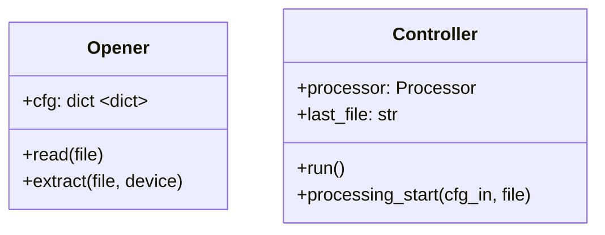

# Программа обработки экспериментальных данных

## Todo

- файл конфигурации
- 

## UML-диаграмма

```mermaid
classDiagram

class Opener {
	+cfg: dict ~dict~
	+read(file)
	+extract(file, device)
}

class Controller {
	+processor: Processor
	+last_file: str
	+run()
	+processing_start(cfg_in, file)
}


```