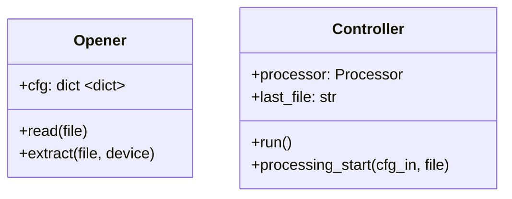

# Программа обработки экспериментальных данных

## Todo

- Модуль конфигурации подгружает конфиги из файлов, хранит значения по умолчанию, по запросу процессора опрашивает элементы интерфейса и формирует текущие настройки обработки.
- Модуль графопостроения.
- Streamlit загруженные своим инструментом файлы хранит в оперативной памяти. Строку-адрес получить, как говорят у них на форумах, невозможно.
- Загруженный файл может быть 200 МБ [максимально](https://docs.streamlit.io/library/api-reference/widgets/st.file_uploader).
- Перестройка настроек должна происходить как коллбэк от их изменения, изменение их отображения - тоже.
- Элементы интерфейса свои текущие отображаемые значения должны подтягивать и отображать из текущих настроек.
- Возвращение в цикл при ошибках (в т.ч. файл не найден или имеет неправильную структуру). При этом сейчас возврат при ошибке не работает, т.к. ожидается, что метод будет возвращать данные. Можно попробовать через try - except это осуществить.

## UML-диаграмма

